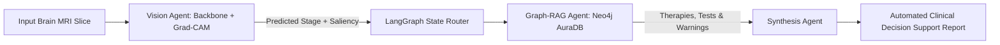

# Multimodal Agentic Clinical Decision Support (Vision + Graph-RAG)

An end-to-end clinical decision support prototype bridging **Deep Learning Computer Vision (XAI)** with a **Neo4j Clinical Knowledge Graph** orchestrated via **LangGraph**. The system classifies Alzheimer’s Disease stages from brain MRI slices, localizes neurodegenerative atrophy patterns using Grad-CAM, and queries evidence-based clinical protocols, biomarker tests, and drug safety warnings.

---

## Architecture Overview



1. **Visual Perception Node:** Uses deep convolutional / capsule feature representations to classify neuroimaging scans into 4 cognitive categories: *Non-Demented, Very Mild, Mild, and Moderate Demented*.
2. **Explainability Engine (Grad-CAM):** Generates gradient-weighted class activation heatmaps to visually ground model predictions on anatomical structures (ventricular expansion and temporal lobe atrophy).
3. **Clinical Knowledge Graph (Neo4j):** Stores structured ontologies linking cognitive diagnoses to recommended biomarker assays (e.g., Plasma p-tau217, MoCA), approved therapies, and critical contraindications (e.g., ARIA risk assessments).
4. **Agentic Orchestrator (LangGraph):** Manages shared state execution across vision interpretation, Cypher-based retrieval, and clinical report synthesis.

---

## Visual Diagnostic Demo

| Input Brain MRI Scan | Grad-CAM Localized Attribution |
| :---: | :---: |
|  |  |

### Sample Clinical Decision Output
```text
### Automated Clinical Decision Support Report
* Diagnostic Prediction: Moderate Demented (Confidence: 32.06%)
* Visual Biomarker Attribution: Grad-CAM saliency generated on cortical & ventricular regions.

Evidence-Based Next Steps (Retrieved via Neo4j):
* Recommended Diagnostic Tests: MMSE Assessment & Caregiver Burden Scale
* Therapeutic Considerations: Memantine + Donepezil Combination Therapy
* Critical Safety & Contraindication Warnings: Cardiac conduction monitoring
```

---

## Repository Structure

```text
├── assets/
│   ├── input_sample.png          # Input brain MRI sample
│   └── gradcam_sample.png        # Output Grad-CAM attribution
├── notebooks/
│   └── multimodal_clinical_rag.ipynb  # End-to-end executable notebook
├── requirements.txt              # Core dependencies
└── README.md
```

---

## Quickstart (Google Colab Setup)

### 1. Clone & Install Dependencies
```bash
git clone [https://github.com/Monisha09-ds/multimodal-clinical-graphrag.git](https://github.com/Monisha09-ds/multimodal-clinical-graphrag.git)
cd multimodal-clinical-graphrag
pip install -r requirements.txt
```

### 2. Environment Configuration
Set up a free **Neo4j AuraDB** cloud instance and configure credentials:
```python
NEO4J_URI = "neo4j+s://<YOUR_INSTANCE_ID>.databases.neo4j.io"
NEO4J_USER = "neo4j"
NEO4J_PASSWORD = "<YOUR_INSTANCE_PASSWORD>"
```

### 3. Run Inference Pipeline
Open `notebooks/multimodal_clinical_rag.ipynb` in Google Colab (GPU Runtime recommended) and run all cells sequentially.

---

## Related Research & Background
This pipeline extends research concepts presented in:
* **"Alzheimer’s Detection Using XAI in Capsule Network and Post Detection Management with Portable Solution"** (*Springer Nature*).

## Author
* **Sabikun Naher Monisha** – [LinkedIn](https://linkedin.com/in/sabikunmonisha) • [GitHub](https://github.com/Monisha09-ds)
